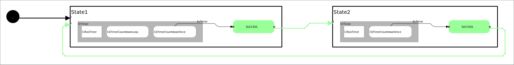

 <h2>State Machine Diagram</h2>

 

 <h2>Description</h2> A completely minimal state machine example.<br></br>

 <h2>Build Instructions</h2>

First, source your chosen ros2 distro.
```
source /opt/ros/rolling/setup.bash
```
```
source /opt/ros/humble/setup.bash
```

Before you build, make sure you've installed all the dependencies...

```
rosdep install --ignore-src --from-paths src -y -r
```

Then build with colcon build...

```
colcon build
```
<h2>Operating Instructions</h2>
After you build, remember to source the proper install folder...

```
source ~/workspace/humble_ws/install/setup.bash
```

And then run the launch file...

```
ros2 launch sm_atomic_services sm_atomic_services.py
```

 <h2>Viewer Instructions</h2>
If you have the SMACC2 Runtime Analyzer installed then type...

```
ros2 run smacc2_rta smacc2_rta
```

If you don't have the SMACC2 Runtime Analyzer click <a href="https://robosoft.ai/product-category/smacc2-runtime-analyzer/">here</a>.
