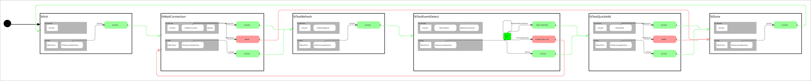

# sm_cl_gcalcli_test_1

 

Unit test state machine for the `cl_gcalcli` client library.

## Overview

This state machine exercises all behaviors and components of the `cl_gcalcli` client library, which provides Google Calendar integration via the `gcalcli` CLI tool.

## State Flow

```
StInit → StWaitConnection → StTestRefresh → StTestEventDetect → StTestQuickAdd → StDone → (loops)
```

## States

| State | Purpose | Behaviors Tested |
|-------|---------|------------------|
| StInit | Entry point | - |
| StWaitConnection | Test connection behaviors | CbWaitConnection, CbStatus |
| StTestRefresh | Test agenda refresh | CbRefreshAgenda |
| StTestEventDetect | Test event detection | CbDetectCalendarEvent, CbMonitorConnection |
| StTestQuickAdd | Test event creation | CbQuickAdd |
| StDone | Test completion | - |

## Prerequisites

1. **gcalcli installed and authenticated:**
   ```bash
   pip install gcalcli
   gcalcli list  # Should show your calendars
   ```

2. **ROS2 workspace built:**
   ```bash
   colcon build --packages-select sm_cl_gcalcli_test_1
   ```

## Running

```bash
# Source workspace
source install/setup.bash

# Launch the test state machine
ros2 launch sm_cl_gcalcli_test_1 sm_cl_gcalcli_test_1.py
```

## Monitoring

```bash
# View state transitions
ros2 topic echo /sm_cl_gcalcli_test_1/smacc/status

# View events
ros2 topic echo /sm_cl_gcalcli_test_1/smacc/event_log

# View transition log
ros2 topic echo /sm_cl_gcalcli_test_1/smacc/transition_log
```

## Notes

- The state machine uses timer-based fallback transitions, so it will run even if gcalcli is not configured
- If gcalcli is not available, the state machine will log warnings and proceed using timer transitions
- The CbQuickAdd behavior will create actual calendar events if gcalcli is configured

## License

Apache-2.0
