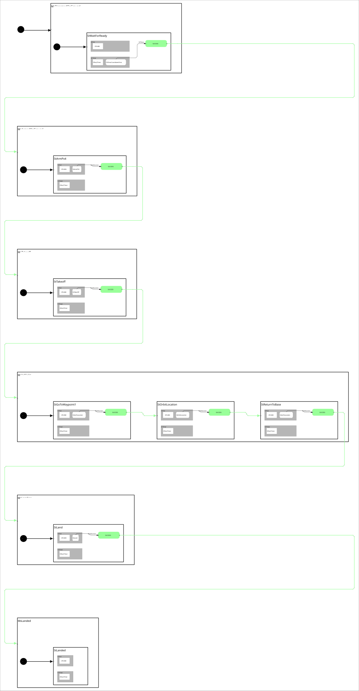

 <h2>State Machine Diagram</h2>

 

<h2>Description</h2>

Test state machine for the `cl_px4_mr` PX4 multirotor client library in Gazebo. Demonstrates a complete autonomous flight mission: wait for readiness, arm, takeoff to 5m, fly to a waypoint, orbit 3 times, return to base, and land. Built on top of the

Uses two orthogonals:
- **OrPx4** - `cl_px4_mr::ClPx4Mr` client for all PX4 vehicle control
- **OrTimer** - `cl_ros2_timer::ClRos2Timer` for timed waits

<h2>Build Instructions</h2>

First, source your ROS 2 installation.
```
source /opt/ros/jazzy/setup.bash
```

Then build with colcon build...
```
colcon build --packages-select cl_px4_mr sm_cl_px4_mr_test_1
```

<h2>Operating Instructions</h2>

Requires four processes running simultaneously:

**Terminal 1 - PX4 SITL:**
```
cd ~/workspaces/PX4-Autopilot
make px4_sitl gz_x500
```

**Terminal 2 - XRCE-DDS Agent:**
```
ros2 run micro_ros_agent micro_ros_agent udp4 -p 8888 2>&1 | tee /tmp/xrce_agent.log
```

**Terminal 3 - QGroundControl** (required for GCS heartbeat so PX4 allows arming)
Follow the installation instructions found here: https://docs.qgroundcontrol.com/master/en/qgc-user-guide/getting_started/download_and_install.html

And then navigate to the appropriate directory and launch it from the terminal:
```  
./QGroundControl-x86_64.AppImage
```

**Terminal 4 - State Machine:**
```
source install/setup.bash
ros2 launch sm_cl_px4_mr_test_1 sm_cl_px4_mr_test_1.launch.py
```

<h2>Mission Flow</h2>

| State | Mode State | Behavior | Action |
|-------|-----------|----------|--------|
| StWaitForReady | MsDisarmedOnGround | CbTimerCountdownOnce(5) | Wait 5 seconds for system readiness |
| StArmPx4 | MsArmedOnGround | CbArmPX4 | Arm vehicle (5 retries, force-arm after 2) |
| StTakeoff | MsTakeoff | CbTakeOff(5.0) | Enable offboard mode, climb to 5m |
| StGoToWaypoint1 | MsInFlight | CbGoToLocation(10, 0, -5) | Fly to waypoint at (10, 0) NED |
| StOrbitLocation | MsInFlight | CbOrbitLocation(10, 0, 5, 5, 0.5, 3) | Orbit 3x around waypoint, r=5m |
| StReturnToBase | MsInFlight | CbGoToLocation(0, 0, -5) | Return to origin |
| StLand | MsLanding | CbLand | Land and wait for auto-disarm |
| StLanded | MsLanded | (none) | Mission complete |

<h2>Log File Locations</h2>

| Component | Location |
|-----------|----------|
| State Machine (ROS 2) | `~/.ros/log/` (latest node log: `sm_cl_px4_mr_test_1_node_*.log`) |
| PX4 SITL (.ulg) | `~/workspaces/PX4-Autopilot/build/px4_sitl_default/rootfs/log/` |
| micro_ros_agent | `/tmp/xrce_agent.log` (when launched with tee redirect above) |

<h2>Viewer Instructions</h2>

If you have the SMACC2 Runtime Analyzer installed then type...
```
ros2 run smacc2_rta smacc2_rta
```

If you don't have the SMACC2 Runtime Analyzer click <a href="https://robosoft.ai/product-category/smacc2-runtime-analyzer/">here</a>.
