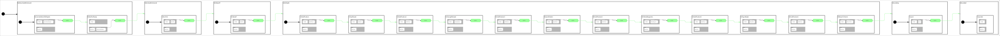

<h2>State Machine Diagram</h2>

 

<h2>Description</h2>

Test state machine for the `cl_px4_mr` PX4 multirotor client library in Gazebo. Exercises the
second batch of behaviors added to the client: hold position, relative yaw rotation, altitude
change, multi-waypoint following, an expanding spiral, a figure-eight, and return-to-home, with a
3 s `CbHoldPosition` settle between each manoeuvre. The mission runs at 15-20 m and stays within
30 m of the takeoff point. `StConnectMicroROSAgent` waits for the micro-ROS agent's node and a
healthy PX4 estimate before proceeding, so the agent must be started first.

Uses two orthogonals:
- **OrPx4** - `cl_px4_mr::ClPx4Mr` client for all PX4 vehicle control
- **OrTimer** - `cl_ros2_timer::ClRos2Timer` for the readiness wait

<h2>Build Instructions</h2>

First, source your ROS 2 installation.
```
source /opt/ros/jazzy/setup.bash
```

Then build with colcon build...
```
colcon build --packages-select cl_px4_mr sm_cl_px4_mr_test_2
```

<h2>Operating Instructions</h2>

Requires four processes, started in this order.

**Terminal 1 - PX4 SITL:**
```
cd ~/workspaces/PX4-Autopilot
make px4_sitl gz_x500
```

**Terminal 2 - QGroundControl** (required for GCS heartbeat so PX4 allows arming)
```
./QGroundControl-x86_64.AppImage
```

**Terminal 3 - micro-ROS agent (XRCE-DDS bridge to PX4):**
```
ros2 run micro_ros_agent micro_ros_agent udp4 -p 8888 2>&1 | tee /tmp/xrce_agent.log
```

**Terminal 4 - State Machine:**
```
source install/setup.bash
ros2 launch sm_cl_px4_mr_test_2 sm_cl_px4_mr_test_2.launch.py
```

<h2>Mission Flow</h2>

| State | Mode State | Behavior | Action |
|-------|-----------|----------|--------|
| StConnectMicroROSAgent | MsDisarmedOnGround | CbConnectMicroRosAgent(30) | Wait for the XRCE agent node and a healthy PX4 estimate |
| StWaitForReady | MsDisarmedOnGround | CbTimerCountdownOnce(5 s) | Let PX4 topics settle |
| StArmPx4 | MsArmedOnGround | CbArmPX4 | Arm (5 retries, force-arm after 2) |
| StTakeoff | MsTakeoff | CbTakeOff(15) | Offboard takeoff to 15 m |
| StHoldPosition | MsInFlight | CbHoldPosition(3 s) | Settle |
| StYawRotate | MsInFlight | CbYawRotate(+90 deg, relative) | Rotate a quarter turn |
| StHoldPosition2 | MsInFlight | CbHoldPosition(3 s) | Settle |
| StChangeAltitude | MsInFlight | CbChangeAltitude(20) | Climb to 20 m |
| StHoldPosition3 | MsInFlight | CbHoldPosition(3 s) | Settle |
| StSpiralPattern | MsInFlight | CbSpiralPattern(0, 0, 20, r 15, spacing 3, 2 m/s) | Expanding spiral about the origin |
| StHoldPosition4 | MsInFlight | CbHoldPosition(3 s) | Settle |
| StFollowWaypoints | MsInFlight | CbFollowWaypoints | (30,0) -> (30,-30) -> (0,-30) at 20 m |
| StHoldPosition5 | MsInFlight | CbHoldPosition(3 s) | Settle |
| StFigureEight | MsInFlight | CbFigureEight(5, 5, 20, size 5, 0.5 rad/s, 3 loops) | Three figure-eights |
| StHoldPosition6 | MsInFlight | CbHoldPosition(3 s) | Settle |
| StReturnToHome | MsInFlight | CbReturnToHome(0, 0, -15, 0) | Back to the origin at 15 m |
| StLand | MsLanding | CbLand | Land and wait for auto-disarm |
| StLanded | MsLanded | (none) | Mission complete |

<h2>Log File Locations</h2>

| Component | Location |
|-----------|----------|
| State Machine (ROS 2) | `~/.ros/log/` (latest node log: `sm_cl_px4_mr_test_2_node_*.log`) |
| PX4 SITL (.ulg) | `~/workspaces/PX4-Autopilot/build/px4_sitl_default/rootfs/log/` |
| micro_ros_agent | `/tmp/xrce_agent.log` |

<h2>Viewer Instructions</h2>

If you have the SMACC2 Runtime Analyzer installed then type...
```
ros2 run smacc2_rta smacc2_rta
```

If you don't have the SMACC2 Runtime Analyzer click <a href="https://robosoft.ai/product-category/smacc2-runtime-analyzer/">here</a>.
