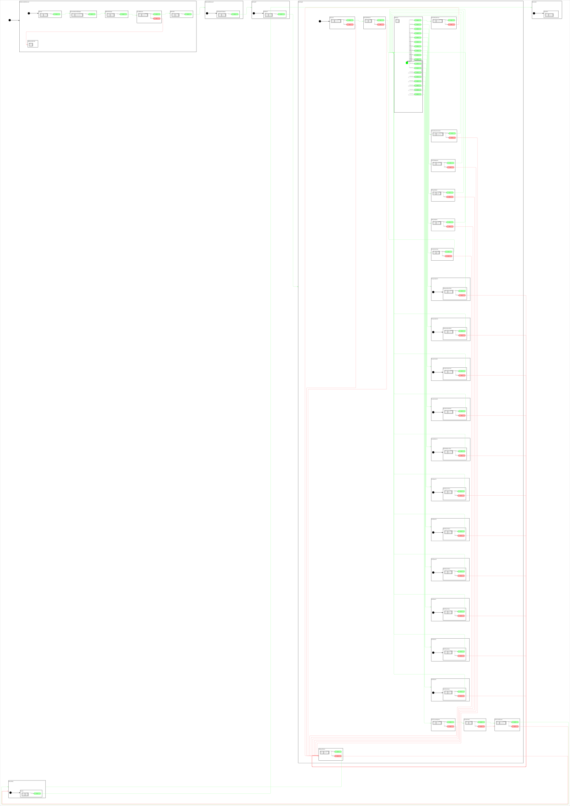

<h2>State Machine Diagram</h2>

 

<h2>Description</h2>

All tunables (altitudes, speeds, ring radius, pattern sizes, sine amplitude, loiter count, timeouts,
fallback backbone) live in `mission_constants.hpp`; every pattern's parameter set is assembled once in
`railway/pattern_params.hpp`, which both the superstates and the planner read. Each plan node carries the
pattern centroid (the pin) and the pattern's entry/exit points computed from those parameters, so transit
legs fly straight to where a pattern starts (a lawnmower corner, a figure-eight lobe tip) rather than to
its centre.

Uses one orthogonal:
- **OrPx4** - `cl_px4_mr::ClPx4Mr` client for all PX4 vehicle control (plus `CbSleepFor` for ground waits)

<h2>Build Instructions</h2>

First, source your ROS 2 installation.
```
source /opt/ros/jazzy/setup.bash
```

Then build with colcon build...
```
colcon build --packages-select cl_px4_mr sm_cl_px4_mr_test_4
```

<h2>Operating Instructions</h2>

PX4 SITL must home on the island (the `default.sdf` world's spherical origin is 26.478999,
56.538333, ~18 m west of B0). Requires four processes, started in this order. The micro-ROS
agent must be running before the state machine starts: `StConnectMicroROSAgent` waits for the
agent's node and for PX4 to report a healthy position estimate, then proceeds.

**Terminal 1 - PX4 SITL:**
```
cd ~/workspaces/PX4-Autopilot
make px4_sitl gz_x500
```

**Terminal 2 - QGroundControl** (GCS heartbeat so PX4 allows arming)
```
./QGroundControl-x86_64.AppImage
```

**Terminal 3 - micro-ROS agent (XRCE-DDS bridge to PX4):**
```
ros2 run micro_ros_agent micro_ros_agent udp4 -p 8888 2>&1 | tee /tmp/xrce_agent.log
```

**Terminal 4 - State Machine (full mission):**
```
source install/setup.bash
ros2 launch sm_cl_px4_mr_test_4 sm_cl_px4_mr_test_4.launch.py
```

<h2>Viewer Instructions</h2>

If you have the SMACC2 Runtime Analyzer installed then type...
```
ros2 run smacc2_rta smacc2_rta
```

If you don't have the SMACC2 Runtime Analyzer click <a href="https://robosoft.ai/product-category/smacc2-runtime-analyzer/">here</a>.
