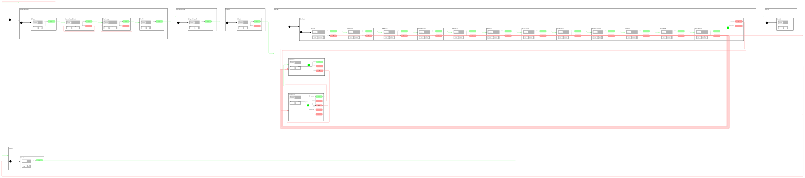

<h2>State Machine Diagram</h2>

 

<h2>Description</h2>

An x500 carrying a spherical 3D lidar explores the DARPA SubT
*Cave Circuit Practice 01* Gazebo world, retraces the route back and
comes back out to the pad. As a finale it laps the base station (the SubT tent at the
cave mouth) twice at 6 m, spirals up around it to 15 m (1.5 m per turn), laps it twice more at
the top, then returns over the pad and lands. The tunnel centering behavior trims the route against the lidar walls. The lidar cloud is bridged to ROS 2 and shown in RViz live and accumulated, in a TF tree
(`map -> base_link -> lidar_link`) broadcast from PX4's own estimate by `CpTfBroadcaster`.

The lidar also gates the flight: a return inside a forward safety cone stops the vehicle
(`StObstacleHold`), and once it clears (or after a bounded wait) the vehicle retraces the
traversed part of the route home (`StReturnHome`); a cloud that stops arriving aborts the
same way. All tunables (altitudes, speed, leash, cone, timeouts, spawn point, route) live in
`config/mission_constants.hpp`.

Uses two orthogonals:
- **OrPx4** - `cl_px4_mr::ClPx4Mr` for all PX4 vehicle control, plus `CpTfBroadcaster`
- **OrLidar** - `cl_generic_sensor::ClGenericSensor<sensor_msgs::msg::PointCloud2>` on
  `/lidar/points` with a 2 s message watchdog, plus `CpForwardObstacleGuard`

<h2>Build Instructions</h2>

First, source your ROS 2 installation.
```
source /opt/ros/jazzy/setup.bash
```

Then build with colcon build...
```
colcon build --packages-select cl_px4_mr sm_cl_px4_mr_test_5
```

<h2>One-time Setup</h2>

Build PX4 SITL once (this also generates `build/px4_sitl_default/rootfs/gz_env.sh`):
```
cd ~/workspaces/PX4-Autopilot
make px4_sitl
```

Fetch the cave world and its tiles from Gazebo Fuel (~100 MB, Open Robotics, CC-BY-4.0):
```
source install/setup.bash
ros2 run sm_cl_px4_mr_test_5 fetch_cave_world.sh
```

<h2>Operating Instructions</h2>

Requires four processes, started in this order. The micro-ROS agent must be running
before the state machine starts: `StConnectMicroROSAgent` waits for the agent's node and
for PX4 to report a healthy position estimate, then `StWaitForReady` refuses to arm until
the EKF heading holds still and matches the parked heading (east): a drifting heading
flips the vehicle on takeoff.

**Terminal 1 - Gazebo (cave world) + PX4 SITL:**
```
source install/setup.bash
ros2 run sm_cl_px4_mr_test_5 start_cave_sitl.sh
```

**Terminal 2 - QGroundControl** (GCS heartbeat so PX4 allows arming)
```
./QGroundControl-x86_64.AppImage
```

**Terminal 3 - micro-ROS agent (XRCE-DDS bridge to PX4):**
```
ros2 run micro_ros_agent micro_ros_agent udp4 -p 8888 2>&1 | tee /tmp/xrce_agent.log
```

**Terminal 4 - bridges, RViz and the State Machine:**
```
source install/setup.bash
ros2 launch sm_cl_px4_mr_test_5 sm_cl_px4_mr_test_5.launch.py
```

The state machine's console output is also written to `/tmp/sm_cl_px4_mr_test_5_latest.log`.

<h2>Negative Tests</h2>

While the vehicle is flying outbound (Terminal 1's world must be running):

- Obstacle in the cone: `ros2 run sm_cl_px4_mr_test_5 spawn_test_box.sh 45 0 3` drops a
  2 m box on the corridor ahead of the vehicle; expect `CpForwardObstacleGuard: OBSTACLE`,
  `StObstacleHold`, then after `ros2 run sm_cl_px4_mr_test_5 remove_test_box.sh`
  `StReturnHome` and a landing on the spawn point.
- Cloud loss: `pkill -f PointCloudPacked` kills only the lidar bridge; expect
  `[CpMessageTimeout] Message timeout occurred` within 2 s, then `StReturnHome`.

<h2>Viewer Instructions</h2>

If you have the SMACC2 Runtime Analyzer installed then type...
```
ros2 run smacc2_rta smacc2_rta
```

If you don't have the SMACC2 Runtime Analyzer click <a href="https://robosoft.ai/product-category/smacc2-runtime-analyzer/">here</a>.
