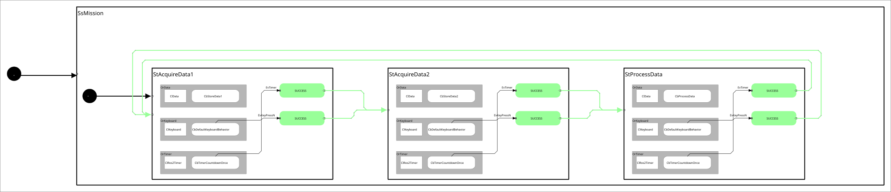

 <h2>State Machine Diagram</h2>

 

 <h2>Description</h2> Demonstrates sharing data across multiple states using superstate member variables. A superstate (<code>SsMission</code>) owns <code>initialPosition</code> and <code>targetPosition</code> fields directly. Client behaviors access these fields without a component: they call <code>this->getCurrentState()->getParentState()</code> to navigate up the state hierarchy and <code>dynamic_cast&lt;SsMission*&gt;</code> to obtain the typed superstate pointer — the behavior-accessible equivalent of <code>context&lt;SsMission&gt;()</code> which is available only inside state classes. <code>CbStoreData1</code> stores the initial position, <code>CbStoreData2</code> stores the target position, and <code>CbProcessData</code> reads both, computes the Euclidean distance, logs the result, and resets the data for the next cycle.<br></br>

 <h2>Build Instructions</h2>

First, source your ros2 installation.
```
source /opt/ros/jazzy/setup.bash
```

Before you build, make sure you've installed all the dependencies...

```
rosdep install --ignore-src --from-paths src -y -r
```

Then build with colcon build...

```
colcon build
```
<h2>Operating Instructions</h2>
After you build, remember to source the workspace...

```
source install/setup.bash
```

And then run the launch file...

```
ros2 launch sm_data_sharing_2 sm_data_sharing_2.launch.py
```

 <h2>Viewer Instructions</h2>
If you have the SMACC2 Runtime Analyzer installed then type...

```
ros2 run smacc2_rta smacc2_rta
```

If you don't have the SMACC2 Runtime Analyzer click <a href="https://robosoft.ai/product-category/smacc2-runtime-analyzer/">here</a>.
