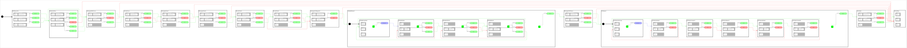

# sm_nav2_gazebo_test_2

 

SMACC2 state machine that exercises **undo path backwards navigation**
(`CbUndoPathBackwards` + `UndoPathGlobalPlanner` + `BackwardLocalPlanner`) in the
Nav2 TurtleBot3 Gazebo simulation.

## Mission

Ten undo navigations per mission: 1 curved, 2 chained, 4 radial rays, 3 F rays.

**Curved-path undo phase**: `StNavigateWithCurve` navigates from the spawn area to
(-2.0, 2.5); the pillar at (-2.0, 1.0) sits directly on the straight line, so the
driven (and recorded) trajectory bows around it. `StUndoCurve` then retraces that
curved path exactly backwards with `CbUndoPathBackwards` — exercising undo on a
curve, unlike the straight rays of the radial pattern.

**Chained-undo phase** (path stack): the robot drives TWO curved legs — back to
(-2.0, 2.5) around the first pillar's east flank, then to (-3.5, -0.5) around its
west flank — and
undoes them both in sequence. Each navigation pushes the previous trail onto the
odom tracker stack; `CbUndoPathBackwards` pops the stack on success, restoring the
earlier leg for the next undo. The first undo of the chain must NOT clear the path
on exit (that would destroy the just-popped trail); only the final undo clears.

**F pattern phase**: `SsFPattern1` (ported from nova_carter sm_nav2_test_7) runs a
boustrophedon pattern from (0.0, -1.5): 3 east-pointing rays of 1.2 m, each
retraced backwards with `CbUndoPathBackwards`, with 0.4 m north pitches between
rows.

`SsRadialPattern1` is a superstate that loops 4 times (radial pattern, modeled on
`sm_nav2_test_7` from the nova_carter_sm_library):

After 4 iterations `EvLoopEnd` exits the superstate to `StFinalState`.

The package provides its own `config/nav2_params.yaml` (stock Jazzy params extended
with the SMACC2 planner/controller plugin family and the cl_nav2z goal checkers) and
`config/default_nav_to_pose_bt.xml` (behavior tree with PlannerSelector,
ControllerSelector and GoalCheckerSelector nodes). Without these, plugin switching —
and therefore undo navigation — cannot work.

## Build

```bash
source /opt/ros/jazzy/setup.bash
rosdep install --ignore-src --from-paths src -y -r
colcon build --packages-select sm_nav2_gazebo_test_2
source install/setup.bash
```

## Run

```bash
ros2 launch sm_nav2_gazebo_test_2 sm_nav2_gazebo_test_2.py
```

Optional runtime viewer:

```bash
ros2 run smacc2_rta smacc2_rta
```

## Debug topics

```bash
# recorded forward path (published by CpOdomTracker, consumed by UndoPathGlobalPlanner)
ros2 topic echo /odom_tracker_path --field poses | grep -c position

# undo plan produced by the global planner
ros2 topic echo /undo_path_planner/global_plan

# plugin selection state
ros2 topic echo /planner_selector
ros2 topic echo /controller_selector
ros2 topic echo /goal_checker_selector

# state machine introspection
ros2 topic echo /SmNav2GazeboTest2/smacc/status
ros2 topic echo /SmNav2GazeboTest2/smacc/transition_log
```

Keyboard: press `N` in the keyboard server terminal to advance states manually.
