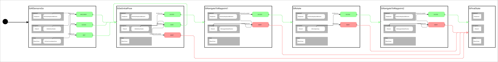

 <h2>State Machine Diagram</h2>

 

 <h2>Description</h2> A Nav2 unit test state machine demonstrating basic navigation and rotation behaviors using the Nav2 stack with TurtleBot3 simulation. The state machine navigates to a waypoint, rotates 180 degrees, then navigates to a second waypoint.<br></br>

 <h2>Build Instructions</h2>

First, source your ros2 installation.
```
source /opt/ros/jazzy/setup.bash
```

Before you build, make sure you've installed all the dependencies...

```
rosdep install --ignore-src --from-paths src -y -r
```

Then build with colcon build...

```
colcon build
```
<h2>Operating Instructions</h2>
After you build, remember to source the workspace...

```
source install/setup.bash
```

And then run the launch file...

```
ros2 launch sm_nav2_unit_test_1 sm_nav2_unit_test_1.launch.py
```

 <h2>Viewer Instructions</h2>
If you have the SMACC2 Runtime Analyzer installed then type...

```
ros2 run smacc2_rta smacc2_rta
```

If you don't have the SMACC2 Runtime Analyzer click <a href="https://robosoft.ai/product-category/smacc2-runtime-analyzer/">here</a>.
