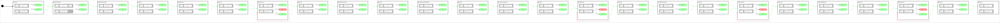

<h2>State Machine Diagram</h2>
 

 
 <h2>Build Instructions</h2>

First, source your ros2 installation.
```
source /opt/ros/jazzy/setup.bash
```

Before you build, make sure you've installed all the dependencies...

```
rosdep install --ignore-src --from-paths src -y -r
```

Then build with colcon build...

```
colcon build
```
  <h2>Operating Instructions</h2>

Then source the proper workspace...

```
source install/setup.bash
```

And then run the launch file...

```
ros2 launch sm_panda_cl_moveit2z_cb_inventory sm_panda_cl_moveit2z_cb_inventory.py
```


 <h2>Viewer Instructions</h2>
If you have the SMACC2 Runtime Analyzer installed then type...

```
ros2 run smacc2_rta smacc2_rta
```

If you don't have the SMACC2 Runtime Analyzer click <a href="https://robosoft.ai/product-category/smacc2-runtime-analyzer/">here</a>
