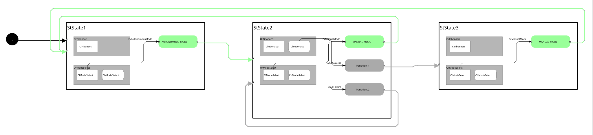

# SM Simple Action Client

 

A SMACC2 tutorial demonstrating topic subscription and action client patterns.

## Overview

This state machine demonstrates:
- **Topic Subscriber Pattern**: `ClModeSelect` subscribes to `/mode_command`
- **Action Client Pattern**: `ClFibonacci` sends goals to Fibonacci action server
- **Three-State Flow**: Demonstrates waiting → executing → completion states

## State Machine Architecture

### States

**StState1 - Waiting for Mode Command**
- **Purpose**: Initial state, waits for autonomous mode trigger
- **Orthogonals**:
  - `OrModeSelect`: Runs `CbModeSelect` behavior (subscribes to `/mode_command`)
  - `OrFibonacci`: Empty (no behavior)
- **Transitions**:
  - `EvAutonomousMode` (when data=1) → **StState2**

**StState2 - Executing Fibonacci Action**
- **Purpose**: Sends Fibonacci calculation request to action server
- **Orthogonals**:
  - `OrModeSelect`: Runs `CbModeSelect` behavior (still monitoring topic)
  - `OrFibonacci`: Runs `CbFibonacci` behavior (sends goal with order=10)
- **Transitions**:
  - `EvCbSuccess` → **StState3** (action succeeded)
  - `EvCbFailure` → **StState2** (stay in state to retry)
  - `EvManualMode` (when data=0) → **StState1**

**StState3 - Action Completed Successfully**
- **Purpose**: Terminal success state, demonstrates completion
- **Orthogonals**:
  - `OrModeSelect`: Runs `CbModeSelect` behavior (still monitoring topic)
  - `OrFibonacci`: Empty (no behavior)
- **Transitions**:
  - `EvManualMode` (when data=0) → **StState1** (restart cycle)

### Interaction Pattern

```
Start
  ↓
┌─────────────────┐
│   StState1      │ ← Manual: publish {data: 0}
│   (Waiting)     │ ←──────────────────────┐
└────────┬────────┘                        │
         │ Auto/Manual: {data: 1}          │
         ▼                                 │
┌─────────────────┐                        │
│   StState2      │                        │
│   (Executing)   │                        │
└─────┬───┬───────┘                        │
      │   │                                │
      │   └─ Failure (retry in StState2)  │
      │                                    │
      ▼ Success                            │
┌─────────────────┐                        │
│   StState3      │                        │
│   (Complete)    │                        │
└─────────────────┘                        │
      │                                    │
      └────────────────────────────────────┘
```

## Build Instructions

First, source your ROS2 installation:
```bash
source /opt/ros/jazzy/setup.bash
```

Before you build, install dependencies:
```bash
rosdep install --ignore-src --from-paths src -y -r
```

Build with colcon:
```bash
colcon build --packages-select sm_simple_action_client
```

## Operating Instructions - Automated Demo

The launch file starts everything automatically for a hands-off demonstration:

```bash
source install/setup.bash
ros2 launch sm_simple_action_client sm_simple_action_client.py
```

**What happens automatically**:
1. **Fibonacci action server** starts in separate konsole window
2. **State machine** starts in StState1 in separate konsole window
3. **Auto-trigger** waits 3 seconds, then publishes autonomous mode command
4. State machine transitions: **StState1** → **StState2**
5. Fibonacci action executes (order=10)
6. On success, state machine transitions: **StState2** → **StState3**
7. State machine remains in StState3 (terminal state)

## Operating Instructions - Manual Control

For learning/testing, you can manually control the state machine:

### Step 1: Start Fibonacci Action Server (in separate terminal)
```bash
ros2 run action_tutorials_cpp fibonacci_action_server
```

### Step 2: Start State Machine (in separate terminal)
```bash
source install/setup.bash
ros2 launch sm_simple_action_client sm_simple_action_client.py
```

### Step 3: Trigger Transitions Manually

**Transition to Autonomous Mode (StState1 → StState2)**:
```bash
ros2 topic pub /mode_command example_interfaces/msg/Int32 "{data: 1}" --once
```

**Return to Manual Mode (StState3 → StState1 or StState2 → StState1)**:
```bash
ros2 topic pub /mode_command example_interfaces/msg/Int32 "{data: 0}" --once
```

## Monitoring the State Machine

**View current state and orthogonals**:
```bash
ros2 topic echo /sm_simple_action_client/smacc/status
```

**View all events being posted**:
```bash
ros2 topic echo /sm_simple_action_client/smacc/event_log
```

**View state transitions**:
```bash
ros2 topic echo /sm_simple_action_client/smacc/transition_log
```

**View state machine structure**:
```bash
ros2 topic echo /sm_simple_action_client/smacc/state_machine_description
```

## Log Files

Logs are automatically saved to timestamped directories:
- **Location**: `~/.ros/log/{timestamp}-sm_simple_action_client/`
- **Files**:
  - `sm_simple_action_client_node_{timestamp}.log` - State machine output
  - `fibonacci_action_server_{timestamp}.log` - Action server output
  - `auto_mode_trigger_{timestamp}.log` - Auto-trigger output

## Components Reference

### Clients

**ClModeSelect** - Topic Subscriber Client
- **Subscribes to**: `/mode_command` (example_interfaces/msg/Int32)
- **Events Posted**:
  - `EvAutonomousMode<ClModeSelect, OrModeSelect>` when message data=1
  - `EvManualMode<ClModeSelect, OrModeSelect>` when message data=0
- **Signals**:
  - `onFirstMessageReceived_` - Emitted on first message
  - `onMessageReceived_` - Emitted on every message

**ClFibonacci** - Action Client
- **Action**: `/fibonacci` (action_tutorials_interfaces/action/Fibonacci)
- **Goal**: Fibonacci sequence with order=10
- **Events Posted**:
  - `EvCbSuccess<CbFibonacci, OrFibonacci>` on successful completion
  - `EvCbFailure<CbFibonacci, OrFibonacci>` on abort/cancellation

### Client Behaviors

**CbModeSelect** - Mode Selection Behavior
- **Type**: SmaccClientBehavior (synchronous)
- **Purpose**: Monitors `/mode_command` topic and posts mode events
- **Lifecycle**:
  - `onEntry()`: Registers callbacks for first message and all messages
  - Callbacks invoke `ClModeSelect` event posting functions based on message data

**CbFibonacci** - Fibonacci Action Behavior
- **Type**: SmaccAsyncClientBehavior (asynchronous)
- **Purpose**: Sends Fibonacci calculation goal to action server
- **Lifecycle**:
  - `onEntry()`: Sends goal (order=100) to action server
  - Waits asynchronously for result
  - `onExit()`: Cancels goal if state exits early
- **Result Handling**:
  - Success → posts `EvCbSuccess`
  - Abort/Failure → posts `EvCbFailure`

### Orthogonals

**OrModeSelect**
- **Purpose**: Manages mode selection client and behavior
- **Client**: ClModeSelect
- **States using this**:
  - StState1: CbModeSelect behavior
  - StState2: CbModeSelect behavior
  - StState3: CbModeSelect behavior

**OrFibonacci**
- **Purpose**: Manages Fibonacci action client and behavior
- **Client**: ClFibonacci
- **States using this**:
  - StState1: No behavior (empty)
  - StState2: CbFibonacci behavior (executes action)
  - StState3: No behavior (empty)

## Troubleshooting

**State machine stuck in StState1**:
- Check if mode command was published:
  ```bash
  ros2 topic echo /mode_command
  ```
- Manually trigger autonomous mode:
  ```bash
  ros2 topic pub /mode_command example_interfaces/msg/Int32 "{data: 1}" --once
  ```

**Fibonacci action not executing**:
- Verify action server is running:
  ```bash
  ros2 action list
  ```
  Should show `/fibonacci` action available
- Start action server manually:
  ```bash
  ros2 run action_tutorials_cpp fibonacci_action_server
  ```

**State machine doesn't transition to StState3**:
- Check Fibonacci action result in logs
- Verify action server is completing successfully
- Check event log:
  ```bash
  ros2 topic echo /sm_simple_action_client/smacc/event_log
  ```

**Konsole windows not appearing**:
- Verify konsole is installed: `which konsole`
- Install if needed: `sudo apt install konsole`
- Logs are still saved even if konsole fails

## Viewer Instructions

If you have the SMACC2 Runtime Analyzer installed:

```bash
ros2 run smacc2_rta smacc2_rta
```

If you don't have the SMACC2 Runtime Analyzer, [click here](https://robosoft.ai/product-category/smacc2-runtime-analyzer/)

## Learning Objectives

This example teaches:
1. **Topic Subscription Pattern**: How SMACC2 clients can subscribe to ROS topics and post events
2. **Action Client Pattern**: How SMACC2 behaviors can interact with ROS action servers
3. **Event-Driven Transitions**: How external events trigger state machine transitions
4. **Orthogonal Architecture**: How multiple concurrent behaviors run in parallel
5. **Async Behaviors**: How long-running operations execute without blocking
6. **State Lifecycle**: Understanding staticConfigure(), runtimeConfigure(), onEntry(), onExit()
